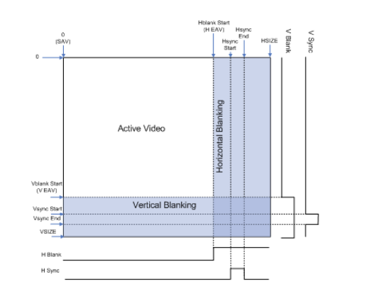
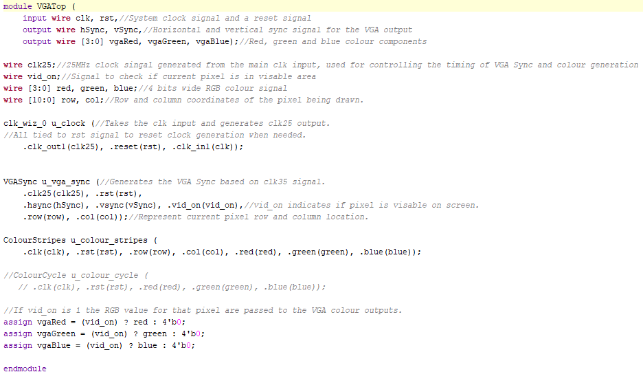
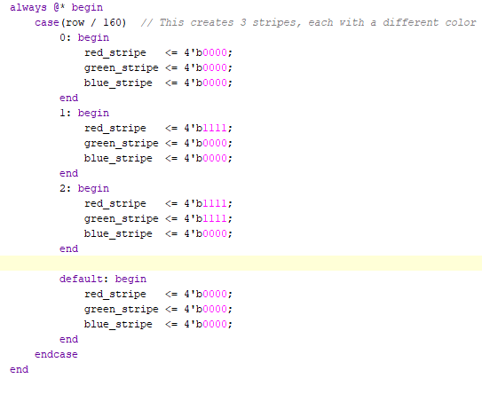

Jamie Montgomery - G00419525
## **VGA Design**
Hello and welcome to my blog on the FPGA VGA Driver Project for System on Chip Design & Verification.
### **Project Set-Up**
The project was set up using Vivado, I imported files from Moodle and added these into Vivado. After everything was imported I adjusted the output clock frequency to 25MHz, this is to match the timing requirements of the VGA signal and the VGA Sync.

### **Template Code**
The first Verilog template would be the VGA Sync, the purpose of this is to generate horizontal and vertical sync signals for the VGA Display. It also tracks the current position of the display (rows and columns) and indicates if the pixel being displayed is in the resolution. For my project the resolution has been set to 640x480. The image on the right gives a greater idea of what each position of the pixel means.

  
  

Another Verilog module called VGATop is designed to control the VGA output. If vid_on, a signal indicating whether the current pixel is within the visable area of the VGA display, is 1 (the pixel is visable) the RGB values for that pixel are passed to the colour outputs. If vid_on is 0, the RGB outputs are set to 0.

For ColourCycle, the finite state machine cycles through the colours for the VGA output, each state represents a colour. The FSM goes through states based on the counter reaching a threshold (COUNT_TO). On the right, the posedge clk and rst blocks the triggers on a rising edge of the signals. If the rst is high then this will initialise the counter to begin counting and reset the colour registers to 0, else if its low, it will assign 4 bits to each register. 

  
  

### **Simulation**
The testbench generates a clock signal (25MHz) and period defined by T. At the beginning of the simulation the rst is asserted to initialise the design. After 2 clock cycles the rst is deasserted and the design starts as normal. VGA sync and the ColourStripes modules work together to generate a VGA sync signal, determines the colour of each pixel. The testbench observes the colour values and pixel coordinates. When the simulation runs, it generates the outputs based on the VGA timing and color logic. The testbench captures the output signal. You can observe how the design behaves under these conditions. I had to debug the testbench as I ran into a problem where the testbench was only testing the ColourCycle, this was due to the ColourStripes VGA not being called in the testbench. Once I established the problem, I added the necessary code to the testbench so it would run the behavioural simulation on the correct output (code for this can be seen on the right).

  
  

### ****Synthesis****
The synthesis process converts a high-level description of the digital system into a netlist (hardware logic). The image below is a slice taken from a configurable logic block. On the left side of the block you can see multiple LUTs, The LUTs are responsible for defining the logic functions to generate pixel colors, below the LUTs there are multiplexers, the MUX selects between multiple inputs based on the control signal, ensuring the correct pattern or color is sent to the output. In the middle section there is a carry chain, the carry chain enables efficient computation of arithmetic operations required for the color transitions.

  
  

### **Implementation**
The implementation process converts high level designs to a working hardware design that can be tested on the physical target. It involves placement, routing and timing analysis. In the image below there is a block called clk, this is the clock signal for driving the design. The rst block initialises the system. The u_clock generates the clock signal, which is 25MHz. The u_vga_sync is responsible for generating the hSync and the vSync, it tracks the vertical and horizontal counts on the screen and outputs the vid_on which indicates if the current pixel is visable. The u_colour_stripes generates the RGB values for the pixels. The output buffering (OBUF) ensures that the signals can be driven to the VGA display without signal degradation. 

### **Demonstration**
This gif is an example of what the VGA displays to the analog output. This is the ColourCycle VGA.

---------------------------------------------------------------------------------------------------------------------------

This is an image of the VGA Colour Stripes code working, I adapted the ColourCycle testbench and VGA Top so the VGA Stripes would work. I had to debug the ColourStripes as it wasn't printing out the correct colours that was set, the cause of this was a loose VGA cable, this took some time to find as I thought it was a bug in my code.

## **My VGA Design Edit**
My design idea was to integrate the colour cycle VGA with the colour stripes VGA and have these 11 colours iterate in a loop on the screen horizontally. This adaption proved to be tough as the code was too bulky and time consuming for a lab session, therefor I chose to create the German flag and analysed 'under the hood' instead of spending too much time on creating a complex design. 
### **Code Adaptation**
I adapted the code from the ColourStripes, I changed it so that it would display the stripes horizontally by splitting the rows into 3 cells, this is seen at the beginning when row / 160 (480/160 = 3). I then assigned the RGB to each row as follows: black, red and yellow

Briefly show how you changed the template code to display a different image. Demonstrate your understanding. Guideline: 1-2 short paragraphs.
### **Simulation**
Show how you simulated your own design. Are there any things to note? Demonstrate your understanding. Add a screenshot. Guideline: 1-2 short paragraphs.
### **Synthesis**
Describe the synthesis & implementation outputs for your design, are there any differences to that of the original design? Guideline 1-2 short paragraphs.
### **Demonstration**
This is a static image of the flag, if i had more time I would've liked to create a non-static VGA display.

If you get your own design working on the Basys3 board, take a picture! Guideline: 1-2 sentences.
## **References**
VGA video frame image: https://adaptivesupport.amd.com/s/article/Video-Series-1-Introduction-to-Digital-Video?language=en_US
Reference to how VGA works: https://www.asic-world.com/verilog/verilog_one_day.html
